# Arsitektur Microservices — RAG for L1 ALELEON HPC Support

Dokumen ini menjelaskan secara teknis dan lengkap seluruh bangunan microservices yang ada di project ini, termasuk hubungan antar service, teknologi yang digunakan, alur data, dan detail implementasi.

---

## 1. Diagram Arsitektur Utama

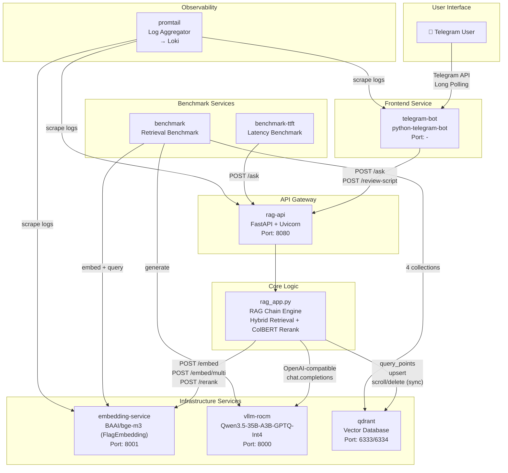

---

## 2. Diagram Alur Data (Request Flow)

### 2.1 Alur `/ask` (Standard Question)

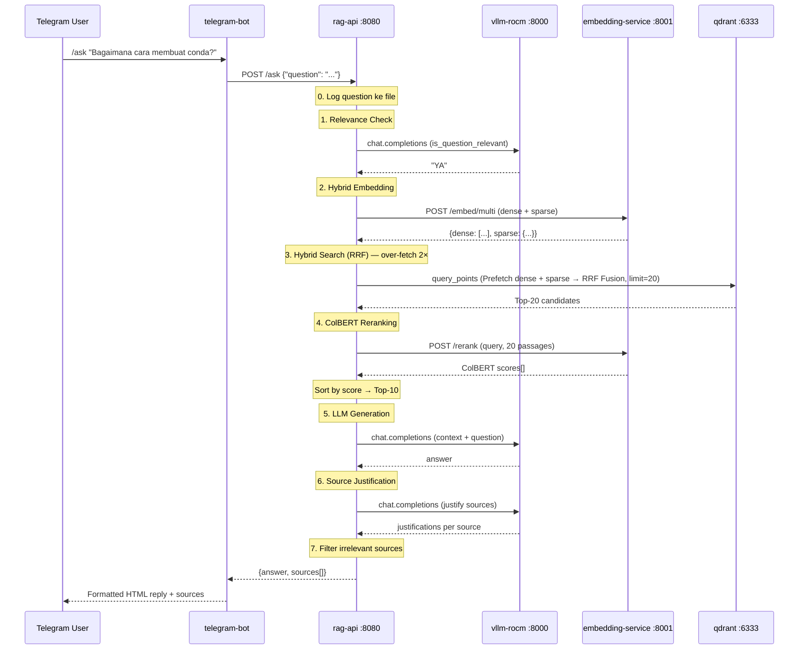

### 2.2 Alur `/askscript` (Hybrid Script Review)

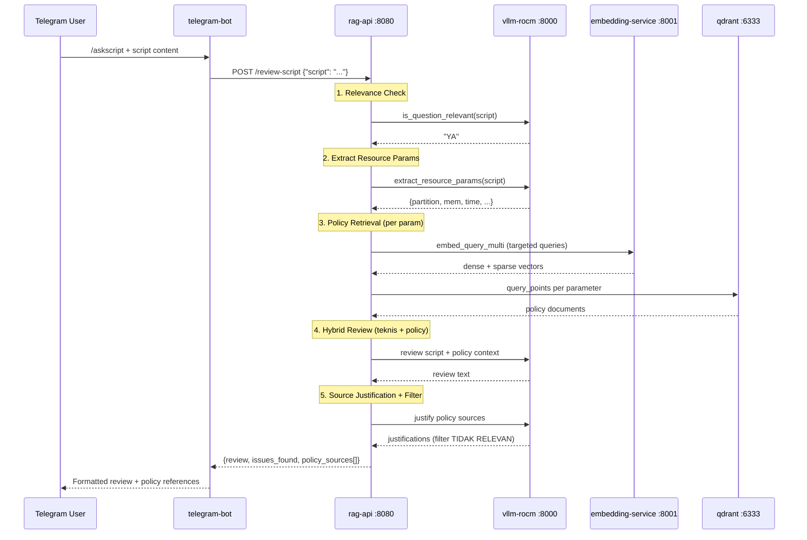

### 2.3 Alur `/refresh` (Incremental Sync)

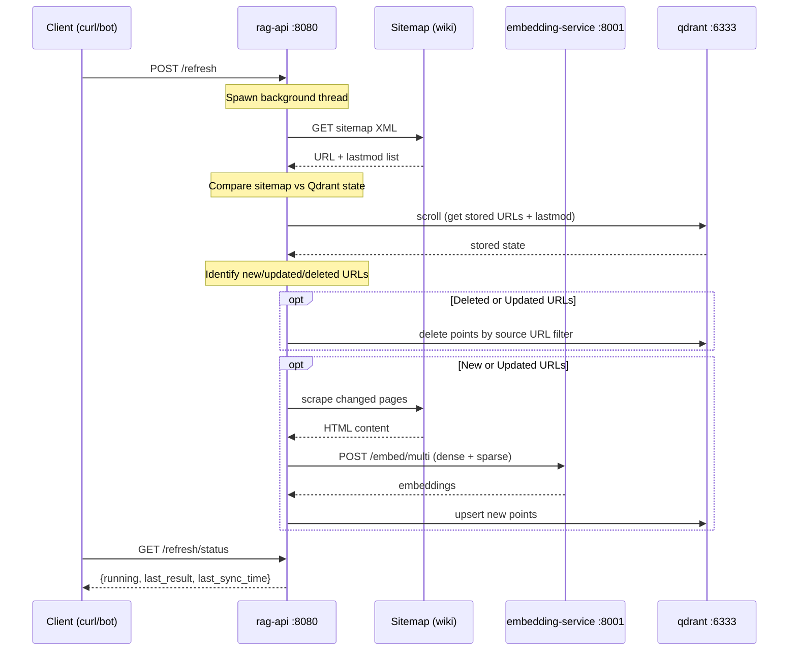

---

## 3. Detail Setiap Microservice

### 3.1 Embedding Service (`embedding-service`)

| Aspek | Detail |
|-------|--------|
| **Lokasi Kode** | `services/embedding/embedding_api.py` |
| **Dockerfile** | `services/embedding/Dockerfile.embedding` |
| **Base Image** | `rocm/pytorch:rocm7.2_ubuntu24.04_py3.12_pytorch_release_2.9.1` |
| **Framework** | FastAPI + Uvicorn |
| **Model** | `BAAI/bge-m3` via FlagEmbedding (`BGEM3FlagModel`) |
| **Port** | `8001` |
| **Version** | `2.0.0` |
| **Profile Compose** | `infra`, `embedding` |

**Endpoints:**

| Endpoint | Method | Fungsi |
|----------|--------|--------|
| `POST /embed` | Dense-only | Backward-compatible, return `List[List[float]]` (1024-dim) |
| `POST /embed/multi` | Multi-mode | Dense + Sparse (lexical) + ColBERT, configurable via flags |
| `POST /rerank` | ColBERT rerank | Rerank passages terhadap query menggunakan ColBERT late-interaction scoring |
| `GET /health` | Health check | Status model |

**Arsitektur Internal:**
- Model di-load saat startup menggunakan `BGEM3FlagModel` dengan `use_fp16=True`
- Sparse output berupa `{indices: List[int], values: List[float]}` — format native Qdrant `SparseVector`
- ColBERT output berupa 2D array (tokens × 1024-dim) untuk late interaction
- Monkey-patch `is_torch_fx_available` untuk kompatibilitas transformers ≥4.47
- Rerank menggunakan `compute_score()` dengan weights `[0.0, 0.0, 1.0]` (ColBERT-only)

**Alur Kerja Embedding Service:**
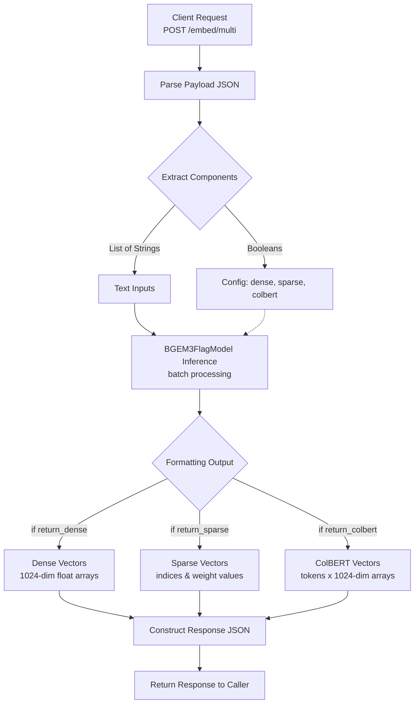

**Alur Kerja Rerank Endpoint:**
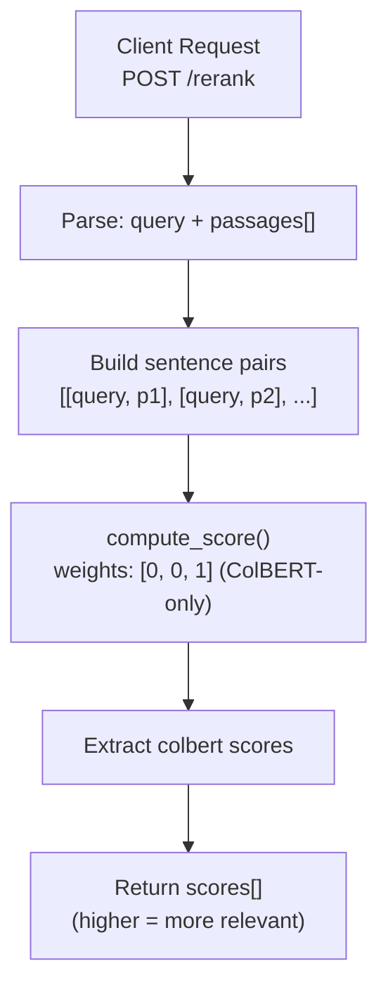

---

### 3.2 LLM Service (`vllm-rocm`)

| Aspek | Detail |
|-------|--------|
| **Image** | `docker.io/rocm/vllm-dev:nightly` |
| **Model** | `Qwen/Qwen3.5-35B-A3B-GPTQ-Int4` |
| **Port** | `8000` (OpenAI-compatible API) |
| **GPU** | AMD ROCm (`/dev/kfd`, `/dev/dri`) |
| **Profile Compose** | `infra`, `vllm` |

**Konfigurasi vLLM:**

```
--dtype float16
--enforce-eager
--gpu-memory-utilization 0.99
--max-model-len 262144
--max-num-seqs 16
--tensor-parallel-size 1
--enable-auto-tool-choice
--tool-call-parser qwen3_coder
--reasoning-parser qwen3
--enable-prefix-caching
--trust-remote-code
```

**API yang Digunakan:**
- `POST /v1/chat/completions` — OpenAI-compatible, diakses via Python `openai` SDK
- Parameter: `temperature=0.3`, `top_p=0.9`, `presence_penalty=1.5`, `top_k=20`
- Non-thinking mode: `extra_body.chat_template_kwargs.enable_thinking = False`

**Environment Variables Compose:**
- `FLASH_ATTENTION_TRITON_AMD_ENABLE=TRUE`
- `TORCH_ROCM_AOTRITON_ENABLE_EXPERIMENTAL=1`

---

### 3.3 Vector Database (`qdrant`)

| Aspek | Detail |
|-------|--------|
| **Image** | `docker.io/qdrant/qdrant:latest` |
| **Port** | `6333` (REST), `6334` (gRPC) |
| **Storage** | Docker volume `qdrant-data` → `/qdrant/storage` |
| **Profile Compose** | `infra`, `qdrant` |

**Collection Utama: `wiki_aleleon_qdrant`**

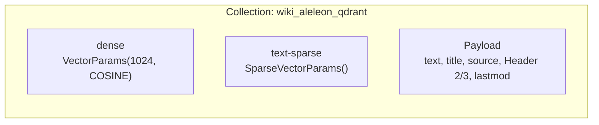

- **Dense vector**: 1024-dim float, cosine distance
- **Sparse vector**: BM25-like lexical weights dari bge-m3
- **Payload**: `text` (chunk content), `title`, `source` (URL), `Header 2`, `Header 3`, `lastmod` (timestamp dari sitemap untuk incremental sync)
- **Retrieval**: Hybrid search via `Prefetch` (dense + sparse) → `RRF Fusion` → ColBERT Reranking

**Konfigurasi Qdrant:**
- `QDRANT__SERVICE__MAX_REQUEST_SIZE_MB=100`

---

### 3.4 RAG Application (`rag-app` / `rag-api`)

| Aspek | Detail |
|-------|--------|
| **Lokasi Kode** | `services/rag-app/rag_app.py` (core), `services/rag-app/rag_api.py` (API) |
| **Dockerfile** | `services/rag-app/Dockerfile.rag-app` |
| **Base Image** | `python:3.11-slim` |
| **Framework** | FastAPI + Uvicorn (API), standalone CLI (interactive) |
| **Port** | `8080` (API mode) |
| **Version** | `1.3.0` |
| **Profile Compose** | `rag-app` (CLI), `api` (REST) |

**Dua Mode Operasi:**
1. **CLI Mode** (`rag-app` profile): Menjalankan `rag_app.py` secara interaktif dengan daftar pertanyaan benchmark
2. **API Mode** (`api` profile): Menjalankan `rag_api.py` sebagai REST server via Uvicorn

**Endpoints API (`rag_api.py`):**

| Endpoint | Method | Request | Response |
|----------|--------|---------|----------|
| `POST /ask` | Question Answering | `{"question": "..."}` | `{answer, sources[{title, source_url, section, justification}]}` |
| `POST /review-script` | Script Review | `{"script": "..."}` | `{review, issues_found, policy_sources[]}` |
| `POST /refresh` | Incremental Sync | - | `{status, result?, message?}` |
| `GET /refresh/status` | Sync Status | - | `{running, last_result, last_sync_time}` |
| `GET /health` | Health check | - | `{status, service}` |
| `GET /` | Service info | - | `{service, version, endpoints}` |

**Startup Sequence (`rag_api.py`):**

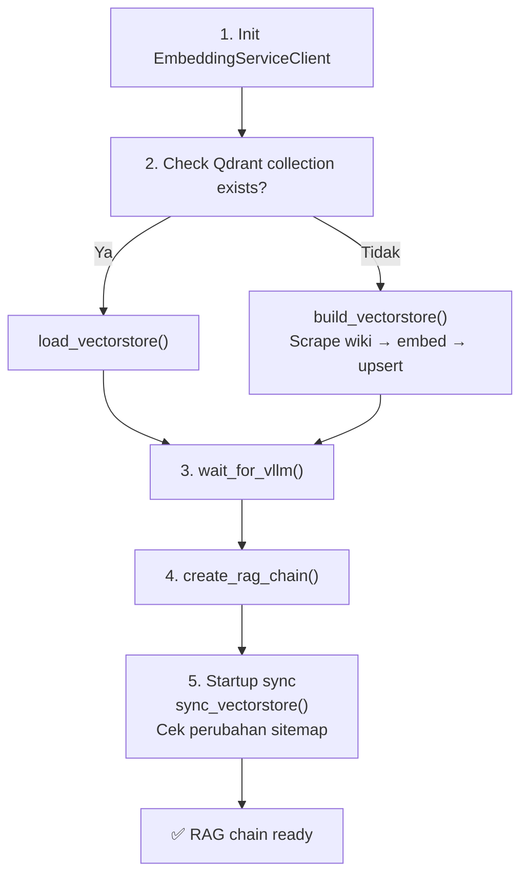

**Komponen Inti `rag_app.py`:**

| Komponen | Fungsi |
|----------|--------|
| `EmbeddingServiceClient` | LangChain-compatible wrapper untuk embedding API, support `embed_query`, `embed_multi`, `embed_query_multi`, `rerank` |
| `parse_sitemap()` | Parse sitemap XML → dict {url: lastmod_str}, filter non-webpage URLs |
| `scrape_wiki_pages()` | Scrape list of wiki URLs → list of Document splits, with lastmod metadata |
| `load_wiki_documents()` | Scrape wiki via sitemap XML → fetch HTML → `HTMLSectionSplitter` (h1/h2/h3) → fallback `RecursiveCharacterTextSplitter` (4500 chars, 900 overlap) |
| `build_vectorstore()` | Full ingestion pipeline: scrape → embed multi → upsert ke Qdrant (dense + sparse) |
| `sync_vectorstore()` | Incremental sync: bandingkan sitemap terkini vs Qdrant → scrape/embed/upsert hanya yang berubah/baru, hapus yang dihapus |
| `get_stored_sitemap_state()` | Scroll Qdrant → {source_url: lastmod} untuk semua unique source URLs |
| `_migrate_add_lastmod()` | One-time migration: tambahkan lastmod ke points lama yang belum punya |
| `is_question_relevant()` | LLM-based relevance filter sebelum RAG processing |
| `create_rag_chain()` | Hybrid retrieval (dense + sparse → RRF → ColBERT rerank) → LLM generation → source justification → irrelevant source filtering |
| `extract_resource_params()` | LLM-based parser untuk #SBATCH directives dari script |
| `retrieve_policy_context()` | Targeted retrieval berdasarkan extracted params (partition, time, mem, GPU, dll) |
| `review_script_hybrid()` | 3-step: extract params → retrieve policy → LLM review (teknis + policy) + source justification + filtering |
| `generate_source_justifications()` | LLM menjelaskan relevansi setiap source, filter "TIDAK RELEVAN" |

**Question Logging:**
- Setiap pertanyaan yang masuk via `POST /ask` di-log ke file `logs/user_questions.logs` dengan timestamp UTC
- Log directory: `/app/logs` (bind-mounted ke `./output/logs` di host)

**Incremental Sync (`sync_vectorstore`):**

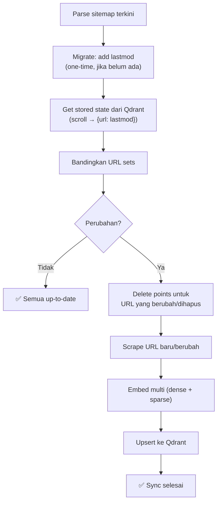

---

### 3.5 Telegram Bot (`telegram-bot`)

| Aspek | Detail |
|-------|--------|
| **Lokasi Kode** | `services/telegram-bot/telegram_bot.py` |
| **Dockerfile** | `services/telegram-bot/Dockerfile.telegram` |
| **Base Image** | `python:3.11-slim` |
| **Library** | `python-telegram-bot[all]`, `requests` |
| **Profile Compose** | `telegram` |
| **Komunikasi** | HTTP ke `rag-api:8080` |

**Commands:**

| Command | Handler | Fungsi |
|---------|---------|--------|
| `/start` | `start()` | Welcome message |
| `/help` | `help_command()` | Usage instructions |
| `/status` | `status()` | Health check RAG API |
| `/ask <question>` | `ask_command()` | Standard RAG Q&A |
| `/askscript <script>` | `askscript_command()` | Hybrid script review |
| File upload (.sh/.slurm/.sbatch/.bash) | `handle_document()` | Auto script review |
| Plain text (tanpa command) | `handle_plain_text()` | Arahkan user gunakan /ask atau /askscript |

**Fitur Teknis:**
- **Progress animation**: Background task dengan `asyncio` yang memutar emoji placeholder + typing indicator (setiap 4 detik)
- **Markdown→HTML converter**: `markdown_to_telegram_html()` — konversi code blocks, bold, italic, strikethrough, headings, links. Code blocks diekstrak ke placeholder terlebih dahulu agar konten (termasuk `#` pada skrip Slurm) tidak terkena transformasi Markdown.
- **HTML splitter**: `split_html_for_telegram()` — otomatis track dan close/reopen HTML tags di batas 4000 char
- **Fallback**: Jika HTML parse gagal, strip semua tags dan kirim plain text
- **Post-init**: Daftarkan command menu ke Telegram API (`set_my_commands`) agar muncul di autocomplete

---

### 3.6 Benchmark Retrieval (`benchmark`)

| Aspek | Detail |
|-------|--------|
| **Lokasi Kode** | `services/benchmark_retrieval/benchmark_retrieval.py` |
| **Dockerfile** | `services/benchmark_retrieval/Dockerfile.benchmark` |
| **Base Image** | `python:3.12-slim` |
| **Profile Compose** | `benchmark` |
| **Output** | `./output/benchmark/` (bind mount) |

**4 Metode Retrieval yang Dibandingkan:**

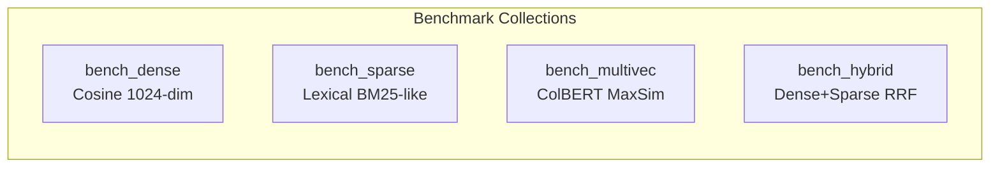

| Metode | Collection | Teknik |
|--------|-----------|--------|
| Dense | `bench_dense` | Cosine similarity pada vektor 1024-dim |
| Sparse | `bench_sparse` | Lexical weights (BM25-like dari bge-m3) |
| Multi-Vector | `bench_multivec` | ColBERT late interaction (MaxSim) |
| Hybrid | `bench_hybrid` | Dense + Sparse → Reciprocal Rank Fusion (RRF) |

**Metrik:** Retrieval time (ms), E2E time (ms), Jaccard overlap antar metode, Ingestion time.

**Mode Operasi:**
- `--mode ingest` — Ingest data saja
- `--mode query` — Benchmark query saja (opsi: `--no-llm`, `--questions N`)
- `--mode all` — Ingest + query
- `--mode cleanup` — Hapus collection benchmark

---

### 3.7 Benchmark TTFT (`benchmark-ttft`)

| Aspek | Detail |
|-------|--------|
| **Lokasi Kode** | `services/benchmark_ttft/run-rag-bench.py` |
| **Dockerfile** | `services/benchmark_ttft/Dockerfile.rag-bench` |
| **Base Image** | `python:3.11-slim` |
| **Library** | `aiohttp` (async HTTP) |
| **Profile Compose** | `benchmark-ttft` |
| **Output** | `./output/benchmark_ttft/` (bind mount) |
| **Questions** | `services/benchmark_ttft/question.txt` (49 pertanyaan, 4 level) |

**Metrik:** E2E latency per request, P50/P99 latency, throughput (RPS).
**Concurrency levels:** 1, 2, 4, 8, 16 (configurable via env `CONCURRENCY_LEVELS`).
**Default requests:** 49 (configurable via env `NUM_REQUESTS`).

---

### 3.8 Promtail (`promtail`)

| Aspek | Detail |
|-------|--------|
| **Image** | `docker.io/grafana/promtail:latest` |
| **Config** | `services/promtail/config.yml` |
| **Profile Compose** | `monitoring` |
| **Target** | Loki di `http://172.16.1.10:3100` |

**Cara Kerja:**
- Scrape log container via Podman socket (`$XDG_RUNTIME_DIR/podman/podman.sock`)
- Label: `container` (nama), `image`, `service` (compose service), `user` (host user)
- Docker SD (service discovery) dengan refresh setiap 5s

---

## 4. Diagram Deployment (Container Topology)

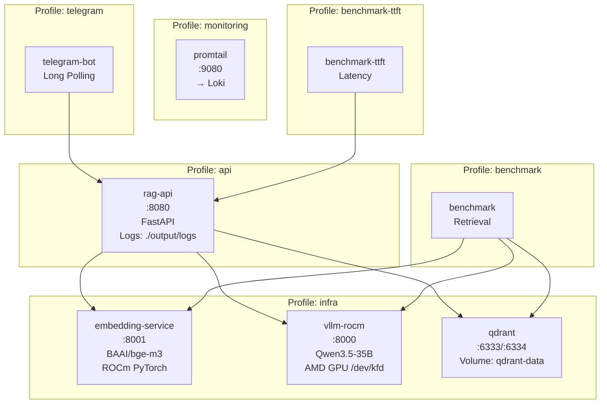

---

## 5. Tabel Ringkasan Service

| Service | Port | Base Image | Profile | Healthcheck | Restart |
|---------|------|-----------|---------|-------------|---------|
| `embedding-service` | 8001 | `rocm/pytorch:rocm7.2` | infra, embedding | `curl /health` | unless-stopped |
| `vllm-rocm` | 8000 | `rocm/vllm-dev:nightly` | infra, vllm | `curl /health` | unless-stopped |
| `qdrant` | 6333, 6334 | `qdrant/qdrant:latest` | infra, qdrant | TCP `/healthz` | unless-stopped |
| `rag-app` | - | `python:3.11-slim` | rag-app | - | - |
| `rag-api` | 8080 | `python:3.11-slim` | api | `curl /health` | unless-stopped |
| `telegram-bot` | - | `python:3.11-slim` | telegram | `pidof python` | unless-stopped |
| `benchmark` | - | `python:3.12-slim` | benchmark | - | - |
| `benchmark-ttft` | - | `python:3.11-slim` | benchmark-ttft | - | - |
| `promtail` | 9080 | `grafana/promtail:latest` | monitoring | `promtail --version` | always |

---

## 6. Environment Variables

| Variable | Service | Default | Deskripsi |
|----------|---------|---------|-----------|
| `EMBEDDING_API_URL` | rag-app, rag-api, benchmark | `http://embedding-service:8001` | URL embedding service |
| `LLM_API_URL` | rag-app, rag-api | `http://vllm-rocm:8000/v1` | URL vLLM OpenAI API |
| `LLM_API_KEY` | rag-app, rag-api | `EMPTY` | API key vLLM (jika diperlukan autentikasi) |
| `LLM_MODEL_NAME` | rag-app, rag-api, benchmark | `Qwen/Qwen3.5-35B-A3B-GPTQ-Int4` | Nama model LLM |
| `QDRANT_URL` | rag-app, rag-api, benchmark | `http://qdrant:6333` | URL Qdrant REST |
| `QDRANT_API_KEY` | rag-app, rag-api, benchmark | `your-secret-key` | API key Qdrant |
| `TELEGRAM_TOKEN` | telegram-bot | - | Bot token dari BotFather |
| `RAG_API_URL` | telegram-bot, benchmark-ttft | `http://rag-api:8080` | URL RAG API internal |
| `MODEL_NAME` | embedding-service | `BAAI/bge-m3` | Nama model embedding |
| `NUM_REQUESTS` | benchmark-ttft | `49` | Jumlah request per concurrency level |
| `CONCURRENCY_LEVELS` | benchmark-ttft | `1,2,4,8,16` | Level concurrency benchmark |
| `HEALTH_CHECK_RETRIES` | benchmark-ttft | `30` | Retry count health check sebelum benchmark |
| `HEALTH_CHECK_INTERVAL` | benchmark-ttft | `10` | Interval (detik) antara health check retry |
| `RESULT_DIR` | benchmark-ttft | `/app/output/benchmark_ttft` | Direktori output hasil benchmark |

---

## 7. Data Ingestion Pipeline

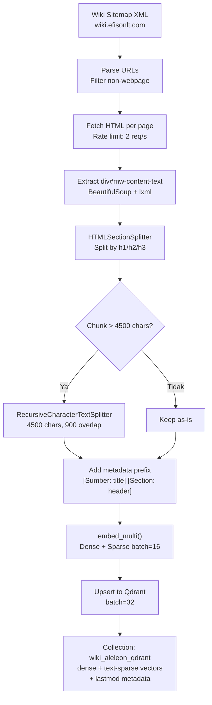

---

## 8. Hybrid Retrieval Pipeline

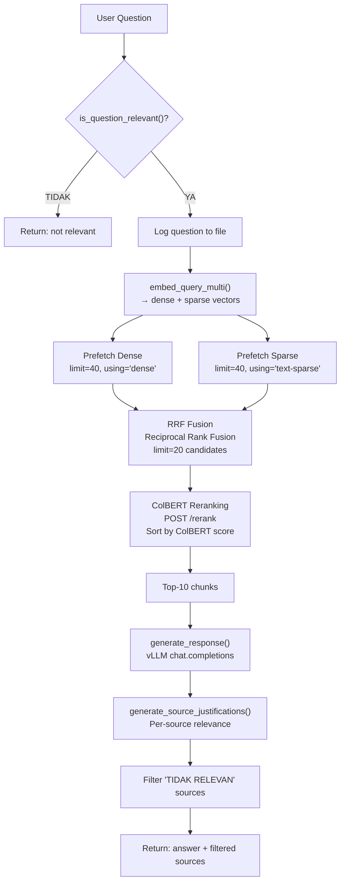

**Detail Retrieval Constants:**

| Constant | Value | Deskripsi |
|----------|-------|-----------|
| `TOP_K` | 10 | Jumlah final chunks yang dikirim ke LLM |
| `RERANK_FETCH_MULTIPLIER` | 2 | Over-fetch 2× TOP_K dari Qdrant untuk reranking |
| `DENSE_DIM` | 1024 | Dimensi dense vector dari bge-m3 |

---

## 9. Perintah Deployment

```bash
# Start semua infrastructure
podman-compose --profile infra up -d

# Start full stack (API + Telegram)
podman-compose --profile infra --profile api --profile telegram up -d

# Benchmark retrieval
podman-compose --profile infra up -d
podman-compose --profile benchmark run benchmark
podman-compose --profile benchmark run benchmark --mode ingest
podman-compose --profile benchmark run benchmark --mode query --no-llm
podman-compose --profile benchmark run benchmark --mode query --questions 5
podman-compose --profile benchmark run benchmark --mode cleanup

# Benchmark latency (TTFT)
podman-compose --profile infra --profile api up -d
podman-compose --profile benchmark-ttft run benchmark-ttft

# Monitoring
podman-compose --profile monitoring up -d

# Trigger manual sync (setelah API berjalan)
curl -X POST http://localhost:8080/refresh
curl http://localhost:8080/refresh/status

# Stop & cleanup
podman-compose --profile infra --profile api --profile telegram down

# Stop & cleanup (termasuk volumes)
podman-compose --profile infra --profile api --profile telegram down -v

# Rebuild setelah edit code
podman-compose --profile infra --profile api --profile telegram up -d --build
```
