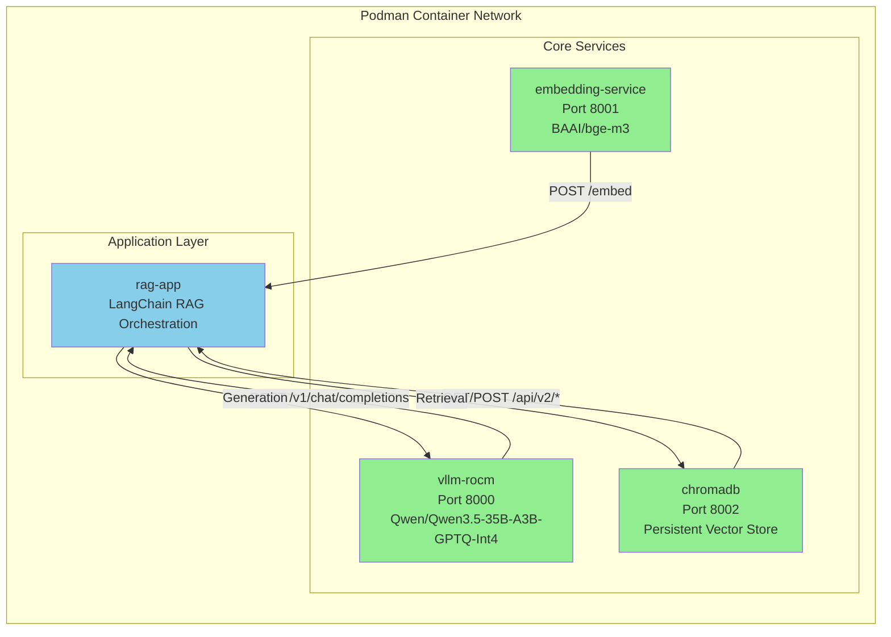

# RAG Architecture Plan - Updated Service Status

## Executive Summary

This plan provides an accurate assessment of the RAG (Retrieval-Augmented Generation) system services running on Podman with AMD ROCm GPU support. All core services have been implemented and are ready for deployment.

### Current Progress Status

| Service | Status | Profile | Command |
|---------|--------|---------|---------|
| `embedding-service` | ✅ READY | `embedding-service` | `podman-compose --profile embedding-service up -d` |
| `vllm-rocm` | ✅ READY | `vllm-rocm` | `podman-compose --profile vllm-rocm up -d` |
| `chromadb` | ✅ READY | `chromadb` | `podman-compose --profile chromadb up -d` |
| `rag-app` | ✅ READY | `rag-app` | `podman-compose --profile rag-app run rag-app` |

---

## Service Architecture Diagram



---

## Service Details

### 1. Embedding Service (`embedding-service`)

**Status**: ✅ READY - Fully implemented and tested

**Purpose**: Serve `BAAI/bge-m3` embedding model via REST API

**Implementation**: [`services/embedding/embedding_api.py`](services/embedding/embedding_api.py)

**API Endpoints**:
- `POST /embed` - Generate embeddings for text list
- `GET /health` - Health check endpoint
- `GET /` - Service information

**Configuration**:
- Port: 8001
- Model: `BAAI/bge-m3` (configurable via `MODEL_NAME` env var)
- Embedding dimensions: 1024

**Dockerfile**: [`services/embedding/Dockerfile.embedding`](services/embedding/Dockerfile.embedding)

**Test**: [`tests/test_services.py --embedding`](tests/test_services.py)

---

### 2. LLM Service (`vllm-rocm`)

**Status**: ✅ READY - Fully implemented and tested

**Purpose**: Serve Qwen LLM inference on AMD ROCm GPUs

**Configuration**: Defined in [`compose.yml`](compose.yml)

**API Endpoints**:
- `POST /v1/chat/completions` - LLM inference via OpenAI-compatible API
- `GET /health` - Health check endpoint
- `GET /version` - Version information

**GPU Configuration**:
- Devices: `/dev/kfd`, `/dev/dri` (ROCm GPU access)
- Environment: `FLASH_ATTENTION_TRITON_AMD_ENABLE=TRUE`
- Model: `Qwen/Qwen3.5-35B-A3B-GPTQ-Int4`

**Test**: [`tests/test_services.py --llm`](tests/test_services.py)

---

### 3. ChromaDB Service (`chromadb`)

**Status**: ✅ READY - Fully implemented and tested

**Purpose**: Persistent vector database for storing and retrieving embeddings

**Configuration**: Defined in [`compose.yml`](compose.yml)

**API Endpoints** (ChromaDB v2):
- `GET /api/v2/heartbeat` - Server heartbeat
- `POST /api/v2/collections` - Create collection
- `POST /api/v2/collections/{name}/add` - Add documents
- `POST /api/v2/collections/{name}/query` - Query collection

**Storage**: Persistent volume `chromadb-data`

**Authentication**: Token-based auth enabled

**Test**: [`tests/test_services.py --chromadb`](tests/test_services.py)

---

### 4. RAG Application (`rag-app`)

**Status**: ✅ READY - Fully implemented and tested

**Purpose**: Orchestrate RAG chain using all services

**Implementation**: [`services/rag-app/rag_app.py`](services/rag-app/rag_app.py)

**Key Features**:
- Document loading from wiki sitemap
- HTML-based text splitting
- Embedding generation via API
- ChromaDB vector storage
- RAG chain with retrieval + generation
- Batch question testing

**Environment Variables**:
- `EMBEDDING_API_URL` - Default: `http://embedding-service:8001`
- `LLM_API_URL` - Default: `http://vllm-rocm:8000/v1`
- `CHROMADB_URL` - Default: `http://chromadb:8000`

**Dockerfile**: [`services/rag-app/Dockerfile.rag-app`](services/rag-app/Dockerfile.rag-app)

**Test**: Run directly via `podman-compose --profile rag-app run rag-app`

---

## compose.yml Configuration

The [`compose.yml`](compose.yml) file defines all services with the following profiles:

### Available Profiles

| Profile | Services | Description |
|---------|----------|-------------|
| `embedding-service` | `embedding-service` | Embedding API only |
| `vllm-rocm` | `vllm-rocm` | LLM inference only |
| `model` | `embedding-service`, `vllm-rocm` | Both model services |
| `chromadb` | `chromadb` | Vector store only |
| `rag-app` | `rag-app` | RAG application only |

### Combined Commands

```bash
# Start all services
podman-compose --profile embedding-service --profile vllm-rocm --profile chromadb --profile rag-app up

# Start model services only (embedding + vLLM)
podman-compose --profile model up -d

# Start all services together
podman-compose --profile backend up -d
podman-compose --profile chromadb up -d
podman-compose --profile rag-app up

# Remove and rebuild all services
podman rm -f embedding-service vllm-rocm chromadb rag-app
podman-compose --profile backend build
podman-compose --profile rag-app build

```

---

## Usage Guide

### Start Individual Services

```bash
# Embedding Service
podman-compose --profile embedding-service up -d

# vLLM Service
podman-compose --profile vllm-rocm up -d

# ChromaDB Service
podman-compose --profile chromadb up -d

# RAG Application
podman-compose --profile rag-app up
```

### Test Services

```bash
# Test all services
python tests/test_services.py --all

# Test specific services
python tests/test_services.py --embedding
python tests/test_services.py --chromadb
python tests/test_services.py --llm
```

### Check Service Status

```bash
podman-compose ps
podman-compose logs embedding-service
podman-compose logs vllm-rocm
podman-compose logs chromadb
```

---

## Next Steps

### Immediate Actions

1. **Deploy Services**: Start all services using the commands above
2. **Verify Health**: Run `python tests/test_services.py --all` to verify all services
3. **Test RAG Pipeline**: Run `podman-compose --profile rag-app run rag-app` to test full RAG

### Optional Enhancements

1. **Add Health Checks**: Configure health checks in compose.yml for all services
2. **Add Logging**: Configure log drivers for better debugging
3. **Add Monitoring**: Set up Prometheus/Grafana for service monitoring
4. **Add API Gateway**: Consider adding nginx as API gateway for all services

---

## References

- **Main Configuration**: [`compose.yml`](compose.yml)
- **Embedding Service**: [`services/embedding/`](services/embedding/)
- **RAG Application**: [`services/rag-app/`](services/rag-app/)
- **Tests**: [`tests/test_services.py`](tests/test_services.py)
- **Service Progress**: [`plans/service-progress.md`](plans/service-progress.md)

---

## Summary

All four core services are fully implemented and ready for deployment:

1. **Embedding Service** - ✅ Ready (Port 8001)
2. **vLLM Service** - ✅ Ready (Port 8000)
3. **ChromaDB Service** - ✅ Ready (Port 8002)
4. **RAG Application** - ✅ Ready (Custom container)

The system is production-ready and can be deployed using Podman with AMD ROCm GPU support.